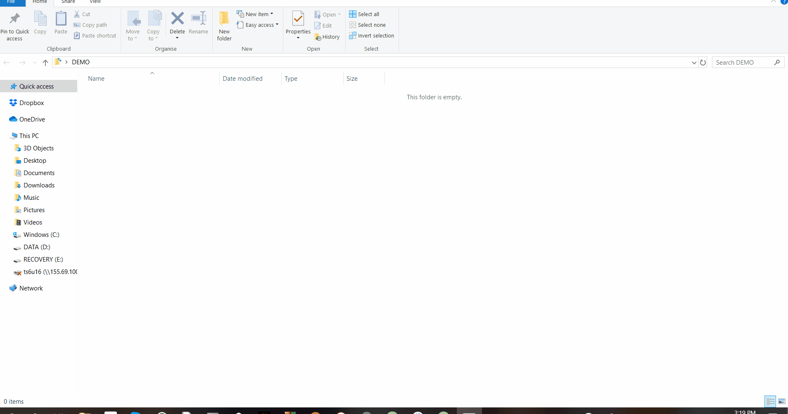
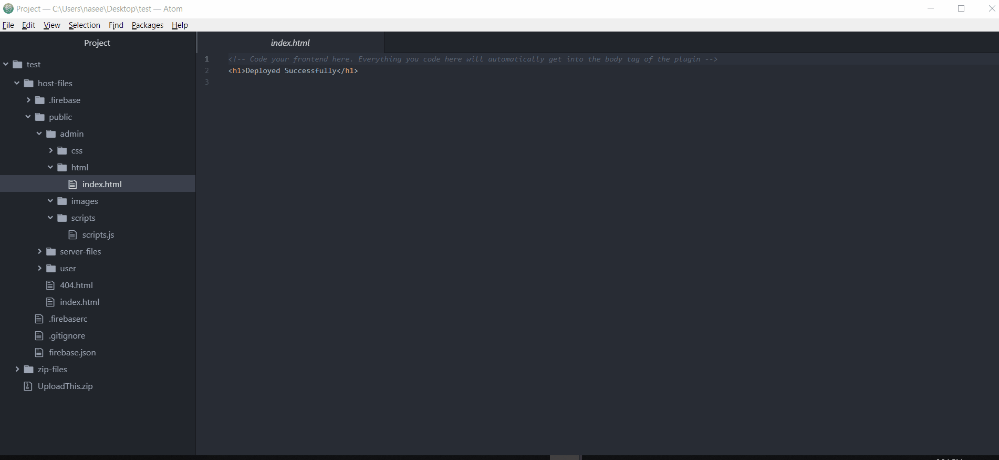

# Arcadier-Tools

These tools are made for developers to increase the efficiency of developing plugins for arcadier marketplaces. Inspiration for making these tools arose from making massive and frequent changes to a plugin. The tools increase development rate for plugins by mitigating the zipping process and reducing uploading changes to the dashboard.

## Installation

Before installing, you need to setup a firebase project. Click [here](https://firebase.google.com/) and login with your google account. Then go to console and add a new project.


You will also need to [download and install Node.js](https://nodejs.org/en/download/).<br/>

Install arcadier-tools using:<br>

Windows
```bash
npm install -g arcadier-tools
```

Mac and Ubuntu
```bash
sudo npm install -g arcadier-tools
```


After installing the package run the following to setup the arcadier-tools. This will take a minute or two so please don't type anything till you see "Setup Complete".

Windows
```bash
arcadier-setup
```

Mac and Ubuntu
```bash
sudo arcadier-setup
```


## Setting up the development environment

### Make a directory

Create a new folder where you would like to make your code.

### Arcadier init

Open command line in this directory and run:

```bash
arcadier init
```


This is where you will be connecting your code to the firebase project you made earlier. Please input the *exact* values given below (You can also refer to the gif above).

* Are you ready to proceed?
  * Y
* Which Firebase CLI features do you want to set up for this folder? Press Space to select features, then Enter to confirm your choices.
  * Hosting: Configure and deploy Firebase Hosting sites
* Select a default Firebase project for this directory:
  * Select the project you made earlier.
* Select a default Firebase project for this directory:
  * *Don't type anything and click enter*
* Configure as a single-page app (rewrite all urls to /index.html)? (*This is very important*)
  * N
* Set up automatic builds and deploys with GitHub?
  * N

This will automatically create the following in your folder:

```bash
├───UploadThis.zip
│
├───host-files
│   │   .firebaserc
│   │   .gitignore
│   │   firebase.json
│   │
│   ├───.firebase
│   │       hosting.cHVibGlj.cache
│   │
│   └───public
│       │   404.html
│       │   index.html
│       │
│       ├───admin
│       │   ├───css
│       │   ├───html
│       │   │      index.html
│       │   │
│       │   ├───images
│       │   └───scripts
│       │           scripts.js
│       │
│       ├───server-files
│       │       renderer.js
│       │
│       └───user
│           ├───css
│           ├───html
│           ├───images
│           └───scripts
│                   scripts.js
│
└───zip-files
    ├───admin
    │   └───html
    │         index.html
    │
    └───user
        └───scripts
               scripts.js                              
```

### Upload the zip

You need to upload the ```UploadThis.zip``` file on your developer dashboard. If you have done everything perfectly, you should see "Deployed Successfully" on your plugin.


### Start Coding!!

Now you have everything ready to start coding. All your code will be written inside the ```host-files``` directory.

#### Admin Front-End

All Admin side Front-End code should be in the index.html file in ```host-files->public->admin->html->index.html```.

#### Admin Back-End

All Admin side back-end code should be in the scripts.js file in ```host-files->public->admin->scripts->scripts.js```. Don't forget to include a scripts tag with src="scripts/scripts.js" in your index.html.

#### Admin CSS

All Admin side CSS should be in the css folder in ```host-files->public->admin->css```. Don't forget to include a link tag in with href="css/filename.css" in your index.html.

#### Admin Images

All Admin side images should be in the images folder ```host-files->public->admin->images```.

#### User Back-End

All User side Back-End code should be in the scripts.js file in ```host-files->public->user->scripts->scripts.js```.<br>
Also note that you cannot add front-end, css or images to user side scripts.

### Pushing Changes

Use the command to push all the changes:

```bash
arcadier deploy
````


*Make sure you hard refresh (ctrl+shift+r) to see the changes*

### Finalizing

Once you are done developing your plugin, it's a good idea to disconnect it from firebase. Use the following command to create a zip file disconnected from firebase.

```bash
arcadier finalize
```


